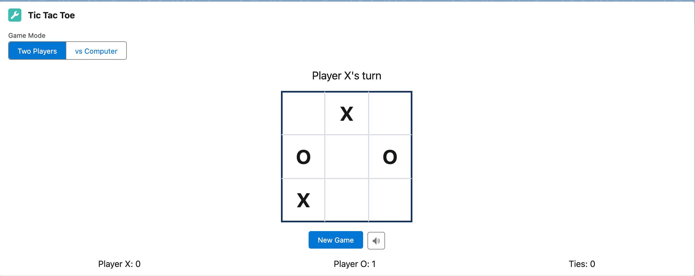

# Salesforce Tic Tac Toe Game.

# LWC Tic Tac Toe Game

A feature-rich implementation of Tic Tac Toe built with Lightning Web Components (LWC) for Salesforce.



## Features

- **Interactive Game Board**: Classic 3x3 Tic Tac Toe game board
- **Player Tracking**: Alternates between X and O players
- **Win Detection**: Automatically detects wins in rows, columns, and diagonals
- **Sound Effects**: Custom audio feedback for different game events
  - Move placement sounds
  - Win/lose/tie sound effects
  - New game sound
- **Animations**: Smooth CSS animations for winning cells and game outcomes
- **Score Tracking**: Keeps track of X wins, O wins, and ties
- **Sound Toggle**: Optional sound effects that can be turned on/off
- **Responsive Design**: Works on desktop and mobile devices

## Installation

### Deploy to a Salesforce Org

1. Clone this repository:
   ```
   git clone https://github.com/gokulbhaveshjoshi/TiaTacToe-Salesforce.git
   cd TiaTacToe-Salesforce
   ```

2. Deploy to your Salesforce org using Salesforce CLI:
   ```
   sfdx force:source:deploy -p force-app/main/default/lwc/ticTacToe
   ```

3. Assign the appropriate permissions to access the component.

### Add to an Existing Lightning Application or Page

1. Open your target Lightning App/Page in the Salesforce App Builder
2. Drag the "Tic Tac Toe" component onto the page
3. Save the page

## Usage

The game is intuitive to use:

1. Players take turns clicking on empty cells to place their mark (X or O)
2. The game automatically detects when a player wins or when there's a tie
3. Click the "New Game" button to start a fresh game
4. Toggle sound effects on/off using the sound icon in the top-right corner
5. The scoreboard keeps track of game results until the component is refreshed

## Component Structure

- **TicTacToe.js**: Main JavaScript controller with game logic
- **TicTacToe.html**: HTML template for the game interface
- **TicTacToe.css**: CSS styling and animations

## Audio Implementation

The game uses the Web Audio API to generate sound effects programmatically, avoiding the need for external audio files. This approach reduces dependencies and ensures the component works across different Salesforce environments.

## Customization

### Styling

You can customize the game's appearance by modifying the CSS. Key style sections include:

- Board styling: Change colors, sizes, and border styles
- Animation effects: Modify keyframe animations for different game states
- Text styling: Update colors and sizes for game status and scoreboard

### Game Mechanics

You can extend the game by modifying the JavaScript:

- Change the board size (would require updating the HTML template too)
- Add different game modes
- Implement an AI opponent
- Add time limits for moves

## Browser Compatibility

This component has been tested and works in:
- Chrome 90+
- Firefox 88+
- Safari 14+
- Microsoft Edge 90+

Note: Sound functionality requires Web Audio API support in the browser.

## Troubleshooting

### Common Issues

- **Sounds not playing**: Some browsers require user interaction before allowing audio to play. Try clicking somewhere on the page first.
- **Rendering issues**: If elements aren't appearing correctly, refresh the page or check browser console for errors.
- **DOM manipulation errors**: If you see "Cannot set properties of undefined" errors, ensure you're checking for element existence before modifying them.

## Contributing

Contributions are welcome! Please feel free to submit a Pull Request.

1. Fork the repository
2. Create a feature branch: `git checkout -b new-feature`
3. Commit your changes: `git commit -m 'Add some feature'`
4. Push to the branch: `git push origin new-feature`
5. Submit a pull request